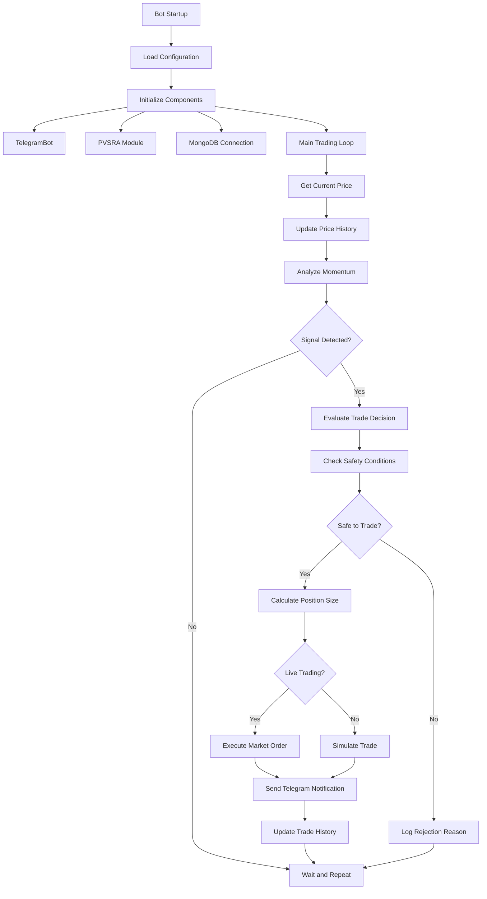

# 🤖 Enhanced Binance Futures Scalping Bot

## 📋 Table of Contents
- [Overview](#overview)
- [Features](#features)
- [Architecture](#architecture)
- [Installation & Setup](#installation--setup)
- [Configuration](#configuration)
- [Classes & Components](#classes--components)
- [Trading Logic](#trading-logic)
- [Safety Features](#safety-features)
- [Usage Examples](#usage-examples)
- [Troubleshooting](#troubleshooting)

---

## 🎯 Overview

This is a **sophisticated cryptocurrency futures trading bot** designed for automated scalping on Binance Futures. The bot combines traditional price momentum analysis with advanced PVSRA (Price Volume Spread Relative Analysis) signals to make intelligent trading decisions.

### Key Highlights
- ✅ **Futures Trading** with leveraged positions
- ✅ **PVSRA Integration** for advanced technical analysis
- ✅ **Telegram Notifications** with rich formatting
- ✅ **MongoDB Logging** for trade history
- ✅ **Risk Management** with position limits and cooldowns
- ✅ **Simulation Mode** for safe testing
- ✅ **Percentage-based Trading** for dynamic position sizing

---

## 🚀 Features

### Core Trading Features
| Feature | Description |
|---------|-------------|
| **Market Orders** | Instant execution at current market price |
| **Leverage Trading** | Configurable leverage (default: 5x) |
| **Position Management** | Automatic position size calculation |
| **Multi-Currency Support** | USDT and USDC balance support |
| **Precision Handling** | Respects exchange minimum requirements |

### Advanced Analysis
| Feature | Description |
|---------|-------------|
| **PVSRA Signals** | Price Volume Spread Relative Analysis |
| **Momentum Analysis** | Price movement detection |
| **Confidence Scoring** | Weighted signal evaluation |
| **Signal Confirmation** | Multiple indicator validation |

### Safety & Risk Management
| Feature | Description |
|---------|-------------|
| **Position Limits** | Prevents multiple positions |
| **Trade Cooldowns** | Prevents overtrading |
| **Balance Checks** | Ensures sufficient funds |
| **Error Recovery** | Graceful failure handling |
| **Simulation Mode** | Paper trading for testing |

### Notifications & Monitoring
| Feature | Description |
|---------|-------------|
| **Telegram Bot** | Real-time trade alerts |
| **Rich Formatting** | Emojis and structured messages |
| **MongoDB Logging** | Trade history storage |
| **ASCII Art Signals** | Visual signal indicators |

---

## 🏗️ Architecture



---

## 📦 Installation & Setup

### Prerequisites
```bash
# Required Python packages
pip install requests
pip install pymongo
pip install python-dotenv

# Optional but recommended
pip install binance-futures-pvsra  # For PVSRA analysis
```

### Environment Variables
Create a `.env` file in your project directory:

```env
# Binance API Configuration
BINANCE_API_KEY=your_api_key_here
BINANCE_API_SECRET=your_api_secret_here

# Trading Configuration
SYMBOL=SUIUSDT
TEST_MODE=True
ENABLE_LIVE_TRADING=False

# Trading Parameters
TRADE_AMOUNT=10
TRADE_AMOUNT_PERCENTAGE=5.0
LEVERAGE=5
PROFIT_THRESHOLD=0.002
STOP_LOSS_THRESHOLD=0.001
MIN_PRICE_CHANGE=0.0003

# Bot Settings
PRICE_UPDATE_INTERVAL=2
TRADE_COOLDOWN=5
ALLOW_MULTIPLE_POSITIONS=False

# PVSRA Configuration
USE_PVSRA=True
PVSRA_WEIGHT=0.7
REQUIRE_PVSRA_CONFIRMATION=False

# Telegram Configuration
TELEGRAM_BOT_TOKEN=your_bot_token_here
TELEGRAM_CHAT_ID=your_chat_id_here

# MongoDB Configuration
MONGODB_URI=mongodb://localhost:27017/
MONGODB_DATABASE=trading_bot
MONGODB_COLLECTION=orders

# Logging
LOG_LEVEL=INFO
```

---

## ⚙️ Configuration

### Trading Modes

#### 1. Fixed Amount Trading
```env
TRADE_AMOUNT=10
# Bot will trade exactly $10 worth per position
```

#### 2. Percentage-based Trading
```env
TRADE_AMOUNT_PERCENTAGE=5.0
# Bot will trade 5% of available balance
```

### Risk Management Settings

| Parameter | Default | Description |
|-----------|---------|-------------|
| `LEVERAGE` | 5 | Leverage multiplier (1-125) |
| `PROFIT_THRESHOLD` | 0.002 | 0.2% profit target |
| `STOP_LOSS_THRESHOLD` | 0.001 | 0.1% stop loss |
| `MIN_PRICE_CHANGE` | 0.0003 | 0.03% minimum price movement |
| `TRADE_COOLDOWN` | 5 | Seconds between trades |

### PVSRA Settings

| Parameter | Default | Description |
|-----------|---------|-------------|
| `USE_PVSRA` | True | Enable PVSRA analysis |
| `PVSRA_WEIGHT` | 0.7 | PVSRA signal weight (0.0-1.0) |
| `REQUIRE_PVSRA_CONFIRMATION` | False | Require PVSRA confirmation |

---

## 🔧 Classes & Components

### 1. TelegramBot Class

```python
class TelegramBot:
    """Handles Telegram notifications and alerts"""
    
    def __init__(self, bot_token: str, chat_id: str)
    def send_message(self, message: str) -> bool
    def send_signal_alert(self, signal_type: str, symbol: str, price: float, confidence: float) -> bool
    def send_trade_execution(self, action: str, symbol: str, quantity: float, price: float) -> bool
    def send_pvsra_signal(self, symbol: str, alert: Dict, price: float) -> bool
```

**Key Features:**
- Rich message formatting with emojis
- Markdown support for formatting
- Error handling and retry logic
- Signal-specific message templates

### 2. EnhancedBinanceFuturesBot Class

```python
class EnhancedBinanceFuturesBot:
    """Main trading bot with advanced features"""
    
    def __init__(self)
    def start(self)
    def get_current_price(self) -> float
    def get_account_balance(self) -> float
    def get_open_positions(self) -> List[Dict]
    def place_market_order(self, side: str, quantity: float) -> Dict
    def should_enter_trade(self, action: str) -> Dict
    def evaluate_pvsra_signal(self, intended_action: str) -> Dict
```

**Key Features:**
- Multi-currency balance support (USDT/USDC)
- Position size calculation with precision handling
- PVSRA signal integration
- Comprehensive safety checks

---

## 🎯 Trading Logic

### Signal Generation Process

```python
# 1. Price Momentum Analysis
recent_prices = list(price_history)[-5:]
price_change = (recent_prices[-1] - recent_prices[0]) / recent_prices[0]

# 2. Determine Action
if price_change > min_price_change:
    potential_action = "BUY"
elif price_change < -min_price_change:
    potential_action = "SELL"

# 3. PVSRA Evaluation
pvsra_eval = evaluate_pvsra_signal(potential_action)

# 4. Combined Confidence Score
final_confidence = (pvsra_confidence * pvsra_weight + 
                   traditional_confidence * (1 - pvsra_weight))
```

### PVSRA Signal Interpretation

| PVSRA Signal | Action | Confidence |
|--------------|--------|------------|
| Bull Climax | BUY | 0.8 |
| Bear Climax | SELL | 0.8 |
| Rising Volume | BUY | 0.6 |
| Other | Neutral | 0.5 |

### Safety Checks Hierarchy

1. **Position Check** - Prevent multiple positions
2. **Price History** - Ensure sufficient data
3. **Price Movement** - Validate significant change
4. **Cooldown** - Prevent rapid trading
5. **Balance** - Ensure sufficient funds
6. **PVSRA Confirmation** - Validate signals

---

## 🛡️ Safety Features

### Position Management
```python
def check_existing_position(self, symbol: str) -> Optional[Dict]:
    """Prevents multiple positions on same symbol"""
    open_positions = self.get_open_positions()
    for position in open_positions:
        if position['symbol'] == symbol:
            return position
    return None
```

### Trade Cooldown
```python
def check_cooldown(self) -> bool:
    """Prevents overtrading with time-based limits"""
    time_since_last = time.time() - self.last_trade_time
    return time_since_last >= self.trade_cooldown
```

### Balance Validation
```python
def calculate_position_size(self, price: float) -> float:
    """Calculates safe position size based on available balance"""
    balance = self.get_account_balance()
    if balance <= 0:
        return 0
    
    # Apply percentage or fixed amount logic
    # Include leverage and precision handling
    return validated_quantity
```

---

## 📱 Telegram Notifications

### Signal Alert Example
```
🟢🚀 LONG SIGNAL DETECTED 🟢🚀

📊 Symbol: SUIUSDT
💰 Price: $2.1234
🎯 Confidence: 85.0%
📝 Reason: PVSRA confirms BUY signal
🔍 PVSRA Signal: Bull Climax
⏰ Time: 2025-06-13 14:30:25 UTC
```

### Trade Execution Example
```
🔥 TRADE EXECUTED 🔥

🟢 Action: BUY
📊 Symbol: SUIUSDT
📦 Quantity: 47.1
💰 Price: $2.1234
💼 Mode: LIVE
⏰ Time: 2025-06-13 14:30:30 UTC
```

### PVSRA Signal Example
```
🎯 PVSRA SIGNAL DETECTED 🎯

📊 Symbol: SUIUSDT
📡 Signal: Bull Climax
💰 Price: $2.1234
🔍 Condition: climax
📈 Volume Ratio: 2.5x
⏰ Time: 2025-06-13 14:30:20 UTC

🤖 Bot will analyze this signal for trading decision...
```

---

## 🎨 Visual Feedback

### ASCII Art Signals

#### BUY Signal
```
============================================================
██████╗ ██╗   ██╗██╗   ██╗
██╔══██╗██║   ██║╚██╗ ██╔╝
██████╔╝██║   ██║ ╚████╔╝ 
██╔══██╗██║   ██║  ╚██╔╝  
██████╔╝╚██████╔╝   ██║   
╚═════╝  ╚═════╝    ╚═╝   
🟢 LONG SIGNAL DETECTED 🟢
============================================================
```

#### SELL Signal
```
============================================================
███████╗███████╗██╗     ██╗     
██╔════╝██╔════╝██║     ██║     
███████╗█████╗  ██║     ██║     
╚════██║██╔══╝  ██║     ██║     
███████║███████╗███████╗███████╗
╚══════╝╚══════╝╚══════╝╚══════╝
🔴 SHORT SIGNAL DETECTED 🔴
============================================================
```

---

## 💻 Usage Examples

### Basic Startup
```python
# Create and start the bot
bot = EnhancedBinanceFuturesBot()
bot.start()

# Bot will automatically:
# 1. Load configuration
# 2. Initialize components
# 3. Start PVSRA monitoring
# 4. Begin trading loop
```

### Manual Position Check
```python
# Check current positions
positions = bot.get_open_positions()
for pos in positions:
    print(f"Position: {pos['symbol']} {pos['side']} {pos['size']}")
    print(f"Entry: ${pos['entry_price']:.4f}")
    print(f"PnL: ${pos['unrealized_pnl']:.2f}")
```

### Manual Order Execution
```python
# Calculate position size
price = bot.get_current_price()
size = bot.calculate_position_size(price)

# Place market order
if bot.enable_live_trading:
    result = bot.place_market_order('BUY', size)
    if result['success']:
        print(f"Order executed: {result['order_id']}")
```

---

## 🔍 Monitoring & Logging

### Log Levels
```python
# Configure logging level
LOG_LEVEL=DEBUG  # DEBUG, INFO, WARNING, ERROR
```

### Log Output Examples
```
2025-06-13 14:30:25 - INFO - 🚀 Trade Signal: BUY
2025-06-13 14:30:25 - INFO -    Confidence: 0.85
2025-06-13 14:30:25 - INFO -    Reason: Combined signal: Traditional(0.70) + PVSRA(0.80)
2025-06-13 14:30:25 - INFO -    Price Change: 0.045%
2025-06-13 14:30:30 - INFO - ✅ Market order executed: BUY 47.1 SUIUSDT
```

### MongoDB Storage
```javascript
// Example trade record
{
  "_id": ObjectId("..."),
  "timestamp": ISODate("2025-06-13T14:30:30Z"),
  "symbol": "SUIUSDT",
  "action": "BUY",
  "quantity": 47.1,
  "price": 2.1234,
  "confidence": 0.85,
  "pvsra_signal": "Bull Climax",
  "session_id": "bot_1718282400"
}
```

---

## 🛠️ Troubleshooting

### Common Issues

#### 1. API Connection Errors
```
❌ Failed to get price: HTTPSConnectionPool(host='fapi.binance.com', port=443)
```
**Solution:** Check internet connection and API credentials

#### 2. Insufficient Balance
```
❌ No available balance
```
**Solution:** Ensure sufficient USDT/USDC in futures account

#### 3. Position Size Errors
```
❌ Failed to calculate position size
```
**Solution:** Check minimum notional requirements and step size

#### 4. PVSRA Import Errors
```
⚠️ PVSRA modules not available: No module named 'binance_futures_pvsra'
```
**Solution:** Install PVSRA module or disable PVSRA features

### Debug Mode
```env
LOG_LEVEL=DEBUG
```
This will show detailed information about:
- API requests and responses
- Signal evaluation process
- Position calculations
- Trade decision logic

### Test Mode
```env
TEST_MODE=True
ENABLE_LIVE_TRADING=False
```
Use testnet for safe testing without real money

---

## 📊 Performance Metrics

### Key Metrics Tracked
- **Total Trades**: Number of executed trades
- **Win Rate**: Percentage of profitable trades
- **Average PnL**: Average profit/loss per trade
- **Sharpe Ratio**: Risk-adjusted return
- **Maximum Drawdown**: Largest loss from peak

### Confidence Score Distribution
- **High Confidence (>0.8)**: PVSRA confirmation + strong momentum
- **Medium Confidence (0.6-0.8)**: Single signal confirmation
- **Low Confidence (<0.6)**: Weak or conflicting signals

---

## 🔮 Future Enhancements

### Planned Features
- [ ] **Stop Loss Orders** - Automatic risk management
- [ ] **Take Profit Orders** - Automatic profit taking
- [ ] **Portfolio Management** - Multi-symbol trading
- [ ] **Backtesting Module** - Historical strategy testing
- [ ] **Web Dashboard** - Real-time monitoring interface
- [ ] **Machine Learning** - Adaptive signal weighting

### API Integrations
- [ ] **TradingView Webhooks** - External signal integration
- [ ] **Discord Notifications** - Alternative notification system
- [ ] **Email Alerts** - Backup notification method

---

## ⚠️ Disclaimer

**This bot is for educational purposes only. Cryptocurrency trading involves significant risk, and you should never trade with money you cannot afford to lose. Past performance does not guarantee future results. Always test thoroughly in simulation mode before enabling live trading.**

---

## 📞 Support

For issues and questions:
1. Check the [Troubleshooting](#troubleshooting) section
2. Review log files for error details
3. Test in simulation mode first
4. Verify API credentials and permissions

---

*Happy Trading! 🚀*
